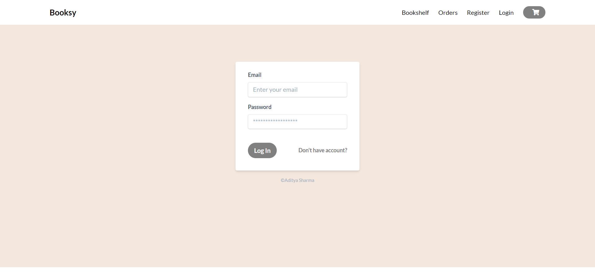
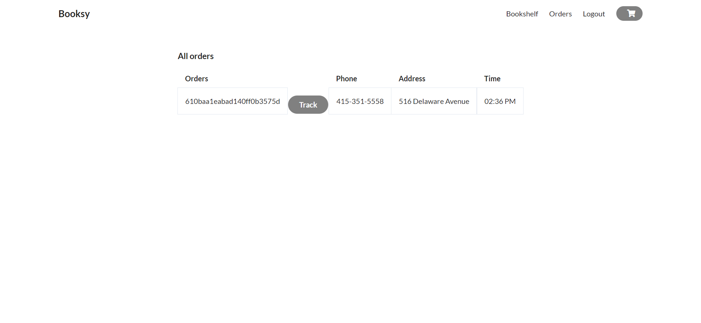

# Booksy

An online bookstore with user management and authentication. It has stripe payment gateway and cart management.
Users can track their package realtime status.

# This is currently available for the desktop screens but will be available for mobile screens soon.

##

```
NPM packages used
- dotenv
- axios
- bcrypt
- ejs
- express
- connect-mongodb
- express-ejs-layouts
- express-flash
- express-sessions
- moment
- mongoose
- nodemon
- noty
- passport
- passport-local
- resolve-url-loader
- socket.io
- stripe
```
## Features

- User management & authentication
- Dynamic book data
- Add to Cart 
- Admin Controls
- Popup notifiactions
- Cart management
- COD & Pay with Card available
- Track your order status

## Dummy Account 

email : user1@abc.com
password : password@123

## Dummy card number

4242424242424242 
4012888888881881 
4000056655665556 
  
## Screenshots
 
 
 
 
 
 
  
